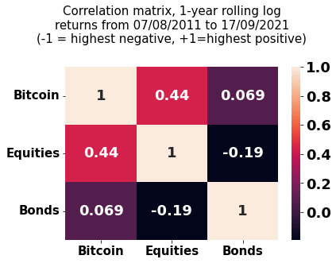

# Crypto Investing Research

## Intro

This project contains a collection of research pieces I've done on crypto investing.

## Table of contents

- [Crypto Investing Research](#crypto-investing-research)
  - [Intro](#intro)
  - [Table of contents](#table-of-contents)
  - [Research topics](#research-topics)
    - [First look at BTC's correlation with traditional assets](#first-look-at-btcs-correlation-with-traditional-assets)
    - [Other topics to cover](#other-topics-to-cover)
  - [Database setup](#database-setup)

## Research topics

### First look at BTC's correlation with traditional assets

One of the most common reasons why people decide to buy Bitcoin is because they believe it offers diversification benefits for a portfolio of traditional assets. [Empirical research](https://research.ark-invest.com/hubfs/1_Download_Files_ARK-Invest/White_Papers/ARKinvest_091729_Whitepaper_Bitcoin_II_An%20Investment.pdf?hsCtaTracking=71be7529-9a39-404e-97b3-04fd4ccf80ec%7C07365ce1-0ed3-4835-9c3c-ac33c030cd70) from Cathie Wood's ARK invest seems to prove this:

However, there's a ton of misinformation about cryptos these days so I wanted to personally verify the theory.

I start by fetching daily prices from 16 Aug 2010 to 15 Sep 2021 for Bitcoin and the following three ETF index trackers:

- Vanguard Total World Stock ETF (VT) - covers all equity markets globally (developed & emerging)
- Vanguard Total Bond Market ETF (BND) - provides exposure to the investment-grade, US dollar-denominated bond market
- iShares International Treasury Bond ETF (IGOV) - offers exposure to non-US dollar denominated investment-grade bonds

I picked ETFs instead of indices (e.g. S&P 500) because the results are more practical. No one cares about hypothetical returns for an index; they want to know what portfolio construction choices they should make based on securities they can actually purchase.

VT is, in my view, the best proxy for a globally-diversified portfolio of equities. Combining BND and IGOV (weighed equally) represents the best compromise for an equivalent in the bonds market. Vanguard's BNDX is actually a more suitable complement to BND, but its inception date is 4 Jun 2013, which would've meant losing two years of data.

I placed all the historical price data in a single pandas DataFrame, then calculated the rolling 12-month logarithmic returns. I used panda's `corr` method to get the correlation matrix and produced the chart with seaborn.

The results show a somewhat higher correlation between Bitcoin and equities compared to the ARK paper. But it's still sufficiently small to allow for potential diversification benefits. The Bitcoin/bonds correlation paints a similar story.

### Other topics to cover

- [ ] how correlation changes over time
- [ ] index development

## Database setup
