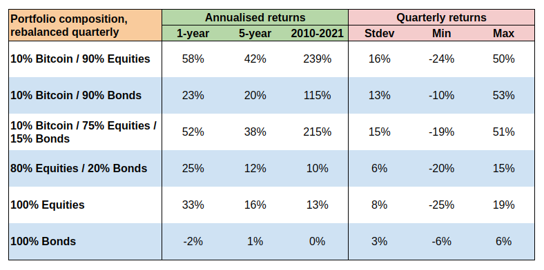

# Crypto Investing Research

A collection of research pieces I've done on crypto investing.

- [Crypto Investing Research](#crypto-investing-research)
  - [Can Bitcoin add value to a portfolio of diversified traditional assets?](#can-bitcoin-add-value-to-a-portfolio-of-diversified-traditional-assets)
    - [Synopsis](#synopsis)
    - [Data sourcing](#data-sourcing)
    - [Asset correlations](#asset-correlations)
    - [Correlation changes over time](#correlation-changes-over-time)
    - [Returns backtesting](#returns-backtesting)
    - [Replicating the research](#replicating-the-research)
  - [Other topics to cover](#other-topics-to-cover)

## Can Bitcoin add value to a portfolio of diversified traditional assets?

### Synopsis

One of the most common reasons why people decide to buy Bitcoin is because they believe it offers diversification benefits for a portfolio of traditional assets. [Empirical research](https://research.ark-invest.com/hubfs/1_Download_Files_ARK-Invest/White_Papers/ARKinvest_091729_Whitepaper_Bitcoin_II_An%20Investment.pdf?hsCtaTracking=71be7529-9a39-404e-97b3-04fd4ccf80ec%7C07365ce1-0ed3-4835-9c3c-ac33c030cd70) from Cathie Wood's ARK invest seems to prove this:

However, there's a ton of misinformation about cryptos these days so I wanted to personally verify the theory.

### Data sourcing

I fetched daily close prices from 16 Aug 2010 to 15 Sep 2021 for Bitcoin and two ETF index trackers:

- Vanguard Total World Stock ETF (VT) - covers all equity markets globally (developed & emerging)
- iShares Global Govt Bond UCITS ETF (IGLO) - index tracker for government bonds issued by the G7 countries (Canada, France, Germany, Italy, Japan, UK and US)

I picked ETFs instead of indices (e.g. S&P 500) because the results are more practical. No one cares about hypothetical returns for an index; they want to know what portfolio construction choices they should make based on securities they can actually purchase.

VT is the best option for a globally-diversified portfolio of equities. IGLO is the best equivalent I could find for the bond market that didn't involve selecting multiple ETFs.

I placed all the historical price data in a single pandas DataFrame, then calculated the rolling 12-month logarithmic returns.

### Asset correlations

I used pandas' [corr](https://pandas.pydata.org/docs/reference/api/pandas.DataFrame.corr.html) method to get the correlation matrix between the returns for Bitcoin, equities and bonds. I then created a [seaborn](https://seaborn.pydata.org/) heatmap with the matrix:

The results show a somewhat higher correlation between Bitcoin and equities compared to the ARK paper (0.44 vs 0.26). But it's still sufficiently small to allow for some diversification benefits.

The Bitcoin/bonds correlation takes an insignificant, positive value (0.069). This should bode well for a portfolio that combines the two asset classes.

### Correlation changes over time

Bitcoin has shot up in popularity since it started trading in 2010. Because of that, I was worried that the above correlation figures might be hiding a trend of significant rises over the last few years, when the cryptocurrency has effectively become mainstream.

For this analysis, I split the log returns DataFrame by year, then calculated the correlation between each asset class combination. I then generated a line plot using pandas' [plot](https://pandas.pydata.org/docs/reference/api/pandas.DataFrame.plot.html) method that leverages [matplotlib](https://matplotlib.org/stable/index.html):

As per the chart, there doesn't seem to be a clear trend in the correlation coefficients so my worries were put to rest.

### Returns backtesting

The two correlation studies we've done so far confirm that Bitcoin can offer some diversification benefits. Now it's time to do the backtests.

The 10% Bitcoin / 90% Equities portfolio offers the best returns. This shouldn't be a surprise - the portfolio is inherently the riskiest of them all. But when you consider the risk in relative terms, it's not as high as you'd expect. Compared to the 100% Equities portfolio, the standard deviation of quarterly returns is only 8 percentage points higher and the minimum return you'd get is even slightly lower!

The Bonds portfolio doesn't seem to add much value though. This might be due to the timeframe coinciding with the longest bull market in history.

Some final points to note:

- The 11-year timeframe I cover in the backtest is relatively short; we have data on stock prices going all the way back to the 1950s.
  
- Bitcoin has never shown poor performance over the course of a 1-year period. That should eventually change in a competitive financial market.

- Because of Bitcoin's significant day-to-day volatility, the timing of the portfolio rebalancings might have a noteworthy impact on the backtest.
  
### Replicating the research

See the [btc.ipynb](./btc.ipynb) Jupyter notebook.

## Other topics to cover

- crypto index
